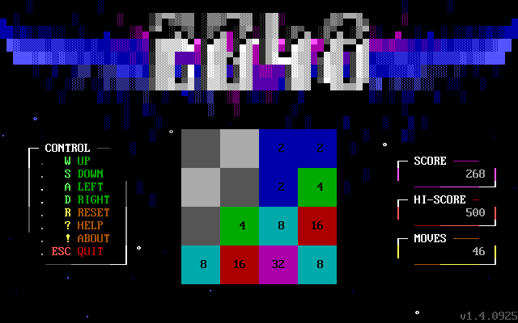

# TMGDL

Text Mode Game Development Library for MS-DOS, version **1.5** (build 0925).

TMGDL is a Pascal library for 80x25 colour text-mode games and tools: direct
screen access with clipping, virtual screens, ANSI art, boxes and dialogs, UI
controls (menus, lists, gauges, counters, help viewer...), a millisecond timer,
file and configuration helpers, and a simple package (resource archive) format.

Supported compilers:

- TMT Pascal 3.5+ (32-bit, default)
- Turbo/Borland Pascal 7.0 (16-bit)
- Free Pascal 3.2 for go32v2 (32-bit, needs `CWSDPMI.EXE` at run time)

## Contents

| Folder | Contents |
| --- | --- |
| `SRC` | The library: `LIBTEXT` (screen, keyboard, timer, dialogs), `LIBCTLS` (controls), `LIBUTIL` (files, folders, drives, config, CRC32), `LIBPACK` (packages), `LIBTMGD` (uses them all) |
| `GAMES` | 2048, Arkanoid, Chomp, Game of Life, Gomoku, Snake, Sokoban, Tic-Tac-Toe and Tetris |
| `TOOLS/PCKMGR` | `PM` package manager, `PCK` command-line packer, `SFX` self-extractor stub |
| `TOOLS/INSTALL` | Installer driven by `INSTALL.DAT` and a package file |
| `TOOLS` | `ASCII` character map, `SCANCODE` key code viewer, `VIEWBIN` screen dump viewer |

## Building

Build settings live in `SRC/MACROS`, shared by every makefile:

- `LIBROOT`/`LIBDIR`: where the compiled units are installed (default `\TMGDL\TEXTMODE\LIB`)
- `BINDIR`: where `make install` copies the games and tools (default `\TMGDL\TEXTMODE\BIN`)
- `TMTROOT`, `TP7ROOT`, `FPCROOT`: compiler locations
- `RM`, `CP`, `MV`, `MD`: file commands used by the makefiles

Every makefile works with the three compilers: TMT Pascal by default, or
Borland Pascal / Free Pascal with `make -DUSE_BPC` / `make -DUSE_FPC`. Each
folder also has a `BUILD.BAT` that takes the compiler as its argument, cleans
and rebuilds. Build and install the library first, then any game or tool,
with the same compiler:

```
cd SRC
BUILD            (TMT Pascal)
BUILD BPC        (Borland Pascal)
BUILD FPC        (Free Pascal)

cd ..\GAMES\2048
BUILD FPC        (or: make -DUSE_FPC)
make -DUSE_FPC install
```

Makefiles with a game or tool: `GAMES\2048`, `GAMES\ARKANOID`, `GAMES\CHOMP`, `GAMES\GOL`,
`GAMES\GOMOKU`, `GAMES\SNAKE`, `GAMES\SOKOBAN`, `GAMES\T3`, `GAMES\TETRIS`, `TOOLS` (ASCII, SCANCODE, VIEWBIN),
`TOOLS\PCKMGR` (PM, PCK, SFX) and `TOOLS\INSTALL`. Programs built with Free
Pascal need `CWSDPMI.EXE` (in `%FPCROOT%\BIN\GO32V2`) in the same folder or on
the `PATH`.

`make clean` in `SRC` removes the installed units. After updating TMGDL, run
`SRC\BUILD.BAT` again and remove any old copies of the units elsewhere in the
compiler's unit path: a mix of old and new units causes "unit version mismatch"
(TPC) or "can't compile unit" (FPC) errors.

The executables stored in the game folders come from earlier releases; rebuild
them to get the versions below. Arkanoid, Chomp, Gomoku, Snake and Sokoban ship
as source only: run `BUILD` in their folders.

## Games

| Game | Version |
| --- | --- |
| 2048 (updated version from https://github.com/dzutrinh/2048) | 1.4 |
| Arkanoid (brick breaker with power-ups) | 1.0 |
| Chomp (maze game: eat the dots, avoid the ghosts) | 1.0 |
| Game of Life | 1.1 |
| Gomoku (five in a row, player vs player or player vs AI) | 1.0 |
| Snake | 1.0 |
| Sokoban (12 original levels) | 1.0 |
| Tic-Tac-Toe (player vs player or player vs AI) | 1.2 |
| Tetris | 1.1 |

### 2048



### Arkanoid


### Chomp


### Game of Life


### Gomoku


### Snake


### Sokoban


### Tic-Tac-Toe


### Tetris


## Tools

### Package manager (PM 1.1)

A two-panel file manager for package files: pack and unpack files (or add to
and delete from an existing package), verify checksums, view package
information, copy, move and rename files, and build self-extracting
executables. **CREATE INSTALLER PACKAGE** (`CTRL-I`) packs the marked files
and writes `INSTALL.DAT` for the installer, with the exact package size. Press
F1 for the key list.


`PCK` does the same from the command line:

```
PCK L GAMES.PCK                 list
PCK T GAMES.PCK                 test the checksum
PCK X GAMES.PCK C:\GAMES        extract
PCK C GAMES.PCK *.EXE *.HLP     create (or @list.txt)
PCK A GAMES.PCK README.TXT      add or replace files
PCK D GAMES.PCK OLD.EXE         delete files
PCK S GAMES.PCK SETUP           make SETUP.EXE, a self-extractor
```

### Installer (INSTALL 1.1)

Installs the files of a package into a chosen drive and folder, after checking
the package size and the free disk space; PACKAGE VERIFICATION checks the
package checksum on request. `INSTALL.DAT` holds
the package name, description, default drive and folder, needed space
(`SPACE`), and the package file and its exact size (`SIZE`). PM creates both
files (`CTRL-I`).


## What's new in 1.5

- Screen output is clipped to the screen, and dialogs, boxes and menus fit on
  it, so they no longer hang or corrupt memory.
- One millisecond timer (`ltx_timer`, `sleep`) that no longer reprograms the
  PIT; `LIBTIMER` was merged into `LIBTEXT`.
- Packages: add, replace and delete files in existing packages, self-extracting
  executables, safe extraction paths, full I/O error checking.
- Counters hold 32-bit values; many nil-pointer, I/O and off-by-one fixes.
- Free Pascal builds work: register usage in the assembler routines was fixed.

## Known issues

- DOSBox 0.74 emulates the x87 FPU with 64-bit doubles. The Free Pascal 3.2
  run-time library copies memory with 64-bit FPU loads and stores, so FPC
  builds show corrupted text there. Use DOSBox-X or real hardware to run FPC
  builds; TMT and Borland Pascal builds are not affected.

## License

MIT, see [LICENSE](./LICENSE).
