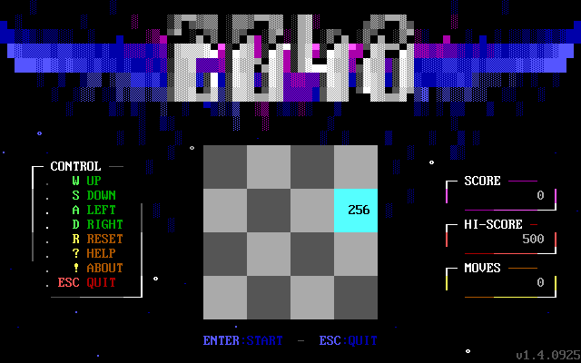
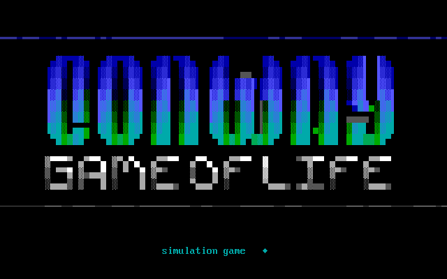
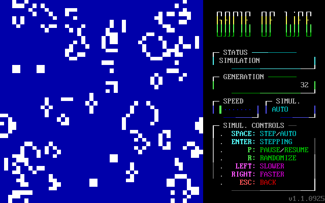
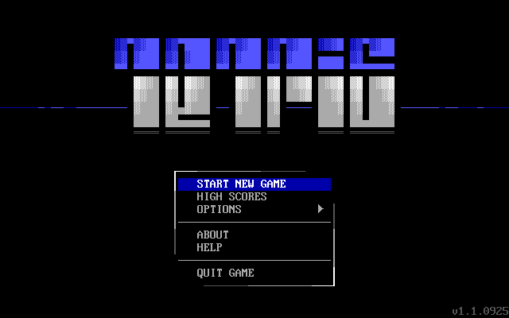
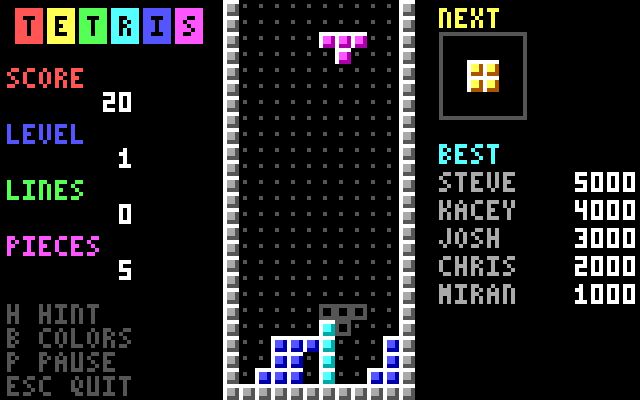
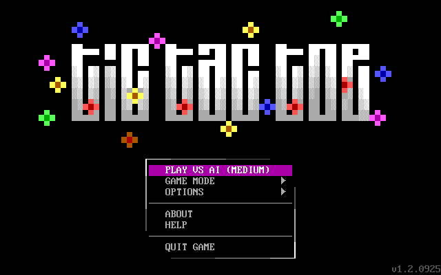
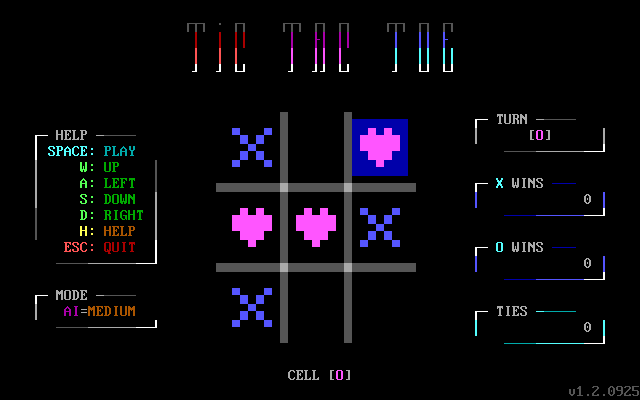

# TMGDL

Text Mode Game Development Library for MS-DOS, version **1.5** (build 0925).

TMGDL is a Pascal library for 80x25 colour text-mode games and tools: direct
screen access with clipping, virtual screens, ANSI art, boxes and dialogs, UI
controls (menus, lists, gauges, counters, help viewer...), a millisecond timer,
half-block pixel graphics, PC-speaker sound and music, high-score tables,
file and configuration helpers, and a simple package (resource archive) format.

Supported compilers:

- TMT Pascal 3.5+ (32-bit, default)
- Turbo/Borland Pascal 7.0 (16-bit)
- Free Pascal 3.2 for go32v2 (32-bit, needs `CWSDPMI.EXE` at run time)

## Games

| Game | Version | What it is |
| --- | --- | --- |
| [2048](#2048) | 1.4 | Slide and merge tiles to reach 2048 |
| [Arkanoid](#arkanoid) | 1.0 | Brick breaker with power-up capsules |
| [Centipede](#centipede) | 1.0 | Shoot the centipede winding through the mushrooms, in 160 x 100 |
| [Chomp](#chomp) | 1.0 | Maze game in 160 x 100 colours, in the style of Paku Paku |
| [Dig Dug](#dig-dug) | 1.0 | Dig tunnels, pump the monsters, drop rocks on them, in 160 x 100 |
| [Dungeon](#dungeon) | 1.0 | Roguelike: ten depths, monsters, items and an amulet to find |
| [Game of Life](#game-of-life) | 1.1 | Conway's cellular automaton, with an editor |
| [Gomoku](#gomoku) | 1.0 | Five in a row against a friend or the computer |
| [Invaders](#invaders) | 1.0 | Space Invaders in 160 x 100, with shields and a saucer |
| [Lander](#lander) | 1.0 | Lunar Lander in 160 x 100: land softly on a pad |
| [Minesweeper](#minesweeper) | 1.0 | Clear the field without setting off a mine |
| [Pipes](#pipes) | 1.0 | Pipe Mania-style: lay a pipeline before the water comes |
| [Reversi](#reversi) | 1.0 | Othello-style disc flipping against a friend or the computer |
| [Runner](#runner) | 1.0 | Lode Runner-style platforms: dig, climb and grab the gold |
| [Snake](#snake) | 1.0 | Eat apples, grow longer, dodge the obstacles |
| [Sokoban](#sokoban) | 1.0 | Push the crates onto the goals, 12 levels |
| [Solitaire](#solitaire) | 1.0 | Klondike patience, drawing one or three cards |
| [Tetris](#tetris) | 1.1 | The falling-blocks classic |
| [Tic-Tac-Toe](#tic-tac-toe) | 1.2 | Noughts and crosses against a friend or the computer |

Every game plays sound effects on the PC speaker; they can be turned off in
its menu (in 2048, with `M`).

## Tools

| Tool | Version | What it is |
| --- | --- | --- |
| [PM](#pm-package-manager) | 1.1 | Full-screen package manager, creates installer packages |
| [PCK](#pck-command-line-packer) | 1.1 | Command-line package tool |
| [SFX](#sfx-self-extractor) | 1.1 | Self-extractor stub for packages |
| [INSTALL](#install-installer) | 1.1 | Installs a package with the settings of `INSTALL.DAT` |
| [ASCII](#ascii-character-map) | - | Character map of the text-mode font |
| [SCANCODE](#scancode-key-code-viewer) | - | Shows the codes of the keys pressed |
| [VIEWBIN](#viewbin-screen-dump-viewer) | - | Shows a screen dump saved with F12 |
| [DEMO](#demo-pixels-and-sound) | - | Half-block pixel scenes with PC-speaker music |
| [MUSICBOX](#musicbox-tune-editor) | 1.0 | Play, write and save tunes for `snd_play` |

## Library

| Unit | Contents |
| --- | --- |
| `LIBTEXT` | Screen, clipping, virtual screens, ANSI art, [half-block pixels](#half-block-pixels), [160 x 100 mode](#low-res-160-x-100-mode), boxes, dialogs, keyboard, millisecond timer |
| `LIBCTLS` | Controls: menus, lists, sliders, gauges, counters, labels, help viewer, life box, colored log view, [forms](#forms), [high-score tables](#high-score-tables) |
| `LIBUTIL` | Files, folders, drives, configuration and text files, CRC32, message boxes |
| `LIBPACK` | Package (resource archive) files: create, extract, read into memory, add, delete, verify, self-extractors |
| `LIBSND` | [PC-speaker sound](#pc-speaker-sound): tones, sound effects and background music |
| `LIBTMGD` | Uses all of the above, plus version and compiler information |

### Forms

`LIBCTLS` has a form control: a dialog of labelled fields, edited in place.
Each field has a kind that decides what can be typed in it and how it is
checked when the user leaves it:

| Kind | Field |
| --- | --- |
| `FK_TEXT` | Any text |
| `FK_UPPER` | Text in capitals |
| `FK_NUMBER` | Whole number, within `formSetRange` |
| `FK_FILENAME` | DOS file name (8.3) |
| `FK_PATH` | Drive, folders and file name |
| `FK_DRIVE` | One drive letter |
| `FK_CHOICE` | One of a list set with `formSetChoices`, picked with the arrows, Space or its first letter |
| `FK_SWITCH` | YES or NO |
| `FK_PASSWORD` | Text shown as stars |

Fields can be required, and can have their own check: a far function that
may tidy the value up and returns `''` when it is right, or the message to
show. Up/Shift-Tab goes back, Down/Tab/Enter goes forward, F10 finishes and
Esc cancels (the values are then left as they were).

```pascal
function checkEven(var value: string): string;
begin
  checkEven := '';
  if odd(atol(value)) then checkEven := 'THE COUNT MUST BE EVEN';
end;

f := formCreate(-1, -1, 0, SHADE_BLUE, ' SETTINGS ');
formAdd(f, 'Player', FK_TEXT, 20, 'Player 1');
formAdd(f, 'Count', FK_NUMBER, 4, '10');
formAdd(f, 'Level', FK_CHOICE, 0, 'NORMAL');
formAdd(f, 'Sound', FK_SWITCH, 3, 'YES');
formSetRequired(f, 1, TRUE);
formSetRange(f, 2, 0, 100);
formSetCheck(f, 2, checkEven);
formSetChoices(f, 3, 'EASY|NORMAL|HARD');
if formExec(f) then
  writeln(formText(f, 1), formNumber(f, 2), formChoice(f, 3), formSwitch(f, 4));
formDestroy(f);
```

PM's *Create installer package* dialog and the installer's destination dialog
are built with it.

### Half-block pixels

`LIBTEXT` can draw with the half-block characters (codes 223, 220 and 219):
every text cell holds two pixels, one above the other, which makes an
80 x 50 screen of 16-colour square pixels (`PIXEL_W` x `PIXEL_H`). The pixels
are drawn on the active screen, so they are clipped like the rest and can go
to a virtual screen and be flipped at once, without flicker. Text can be
printed over them.

```pascal
pixel_clear(0);
pixel_line(0, 0, PIXEL_W - 1, PIXEL_H - 1, 14);
pixel_rect(10, 5, 30, 20, 12);          { outline }
pixel_bar(50, 5, 20, 10, 9);            { filled  }
pixel_circle(40, 25, 12, 10);
pixel_disc(40, 25, 5, 15);
pixel_set(1, 1, 4);
if pixel_get(1, 1) = 4 then ...
```

### Low-res 160 x 100 mode

For finer graphics, `LIBTEXT` can switch an EGA or VGA card to the trick the
CGA games of the 1980s used (Paku Paku among them): the 80 x 25 text mode with
every character row cut down to 4 scan lines, so that 100 rows fit on the
screen, and every cell showing character 222, a right half block. The
background colour of a cell is its left pixel and the foreground its right
one: 160 x 100 pixels in 16 colours (`LORES_W` x `LORES_H`). On VGA the cells
are made 8 dots wide, so both halves are the same; an EGA shows rows of 3 scan
lines, a little flatter. Drawing goes to a buffer that `lores_flip` shows at
once. The text API does not work in this mode: `lores_ask` asks a question in a box
on the canvas, and for the text dialogs (help, sliders) `lores_suspend` goes
back to 80 x 25 text for a while, keeping the canvas, and `lores_resume` brings
it back. `lores_done` ends the mode. There are lines, rectangles, bars and
discs, and a 3 x 5 font writes letters, digits and signs.

```pascal
if not lores_init then die(-1, 'EGA/VGA adapter is required.');
lores_clear(0);
lores_bar(10, 10, 20, 5, 12);
lores_set(80, 50, 15);
lores_text(2, 2, 'SCORE 1200', 14);     { 4 pixels a character }
lores_line(0, 99, 159, 60, 10);
lores_flip;
if lores_ask('QUIT? Y/N', 'YN') = 'Y' then ...
lores_suspend; gameHelp; lores_resume;  { a text dialog in between }
lores_store(saved^);                    { LORES_BYTES: a drawn background }
lores_restore(saved^);                  { ... back at every frame         }
...
lores_done;
```

### PC-speaker sound

`LIBSND` plays tones and music on the PC speaker. `snd_play` starts a tune in
the background and returns at once: the notes go on while the game runs, as
`LIBTEXT` calls the sound unit whenever the program waits (in `sleep`,
`ltx_idle` and while waiting for a key). Tunes are written in the music
language of BASIC's `PLAY`:

| Command | Meaning |
| --- | --- |
| `A`..`G` | A note, `#`/`+` sharp, `-` flat, then an optional length and dots (`C8.`) |
| `N`n | Note number n (1-84, 0 is a rest) |
| `O`n, `<`, `>` | Octave (0-6), one down, one up |
| `L`n | Default length: 1 whole, 4 quarter... 64 |
| `T`n | Tempo, quarter notes a minute (32-255) |
| `P`n, `R`n | A rest |
| `MS`, `MN`, `ML` | Staccato, normal, legato |

Ready-made effects: `SFX_CLICK`, `SFX_BLIP`, `SFX_COIN`, `SFX_HIT`,
`SFX_JUMP`, `SFX_FALL`, `SFX_BOOM`, `SFX_DIE`, `SFX_LEVEL`, `SFX_WIN` and
`SFX_ERROR`. `SND_ENABLED := FALSE` turns all sound off (the games keep it as
an option), and the speaker is always silenced when the program ends.
[MUSICBOX](#musicbox-tune-editor) writes tunes and saves them as Pascal
constants ready for `snd_play`.

```pascal
uses libtext, libsnd;

snd_play(SFX_COIN);                     { in the background }
snd_play_wait('T120 L8 O4 CDEF G4 G4'); { waits for the end }
snd_beep(880, 100);                     { a plain tone      }
if snd_playing then snd_stop;
```

### High-score tables

`LIBCTLS` keeps the best results of a game in a `HISCORE_TABLE`: up to ten
names with a score (the most points win) or a time in seconds (`HS_TIME`, the
least wins), each with a line of information such as the level reached. The
games keep them in `.HI` files. `hiscoreEnter` adds a result to the table if
it is good enough and asks for the name in its row, offering the name typed
last; `hiscoreView` shows the table with a row highlighted, and
`hiscoreDraw` draws it anywhere, such as a side panel.

```pascal
if not hiscoreLoad('GAME.HI', scores) then
begin
  hiscoreInit(scores, 5, HS_POINTS);
  hiscoreFill(scores, 'ANNA|BOB|CARL', 5000, 1000);  { 5000, 4000, 3000 }
end;
...
rank := hiscoreEnter(scores, points, 'LEVEL 4', 'NEW HIGH SCORE', SHADE_GREEN);
hiscoreView(scores, 'HALL OF FAME', SHADE_BLUE, rank);
hiscoreSave('GAME.HI', scores);
```

Every game with a leader board uses it: 2048, Arkanoid, Centipede, Chomp, Dig Dug, Dungeon,
Invaders, Lander, Minesweeper (the best times of each level), Pipes, Runner,
Snake, Solitaire and Tetris.

## Building

Build settings live in `SRC/MACROS`, shared by every makefile:

- `LIBROOT`/`LIBDIR`: where the compiled units are installed (default `\TMGDL\TEXTMODE\LIB`)
- `BINDIR`: where `make install` copies the games and tools (default `\TMGDL\TEXTMODE\BIN`)
- `TMTROOT`, `TP7ROOT`, `FPCROOT`: compiler locations
- `RM`, `CP`, `MV`, `MD`: file commands used by the makefiles

Every makefile works with the three compilers: TMT Pascal by default, or
Borland Pascal / Free Pascal with `make -DUSE_BPC` / `make -DUSE_FPC`. Each
folder also has a `BUILD.BAT` that takes the compiler as its argument, cleans
and rebuilds. Build and install the library first, then any game or tool,
with the same compiler:

```
cd SRC
BUILD            (TMT Pascal)
BUILD BPC        (Borland Pascal)
BUILD FPC        (Free Pascal)

cd ..\GAMES\2048
BUILD FPC        (or: make -DUSE_FPC)
make -DUSE_FPC install
```

Every game folder under `GAMES` has a makefile, as do `TOOLS` (ASCII, SCANCODE, VIEWBIN, DEMO),
`TOOLS\PCKMGR` (PM, PCK, SFX), `TOOLS\INSTALL` and `TOOLS\MUSICBOX`. Programs built with Free
Pascal need `CWSDPMI.EXE` (in `%FPCROOT%\BIN\GO32V2`) in the same folder or on
the `PATH`.

`make clean` in `SRC` removes the installed units. After updating TMGDL, run
`SRC\BUILD.BAT` again and remove any old copies of the units elsewhere in the
compiler's unit path: a mix of old and new units causes "unit version mismatch"
(TPC) or "can't compile unit" (FPC) errors.

The executables stored in the 2048, Game of Life, Tetris and Tic-Tac-Toe
folders come from earlier releases; rebuild them to get the versions listed
here. The other games and the tools ship as source only: run `BUILD` in their
folders.

## Games in detail

### 2048

Slide the tiles of a 4 x 4 board; two equal tiles that meet merge into one of double value. Reach the 2048 tile before the board fills up. Tiles slide with an animation, the game is saved on exit and resumed next time, and the eight best scores are kept.

Keys: `W` `A` `S` `D` slide, `R` new game, `H` high scores, `M` sound on/off, `?` help, `!` about, `ESC` quit.

Folder: [`GAMES/2048`](./GAMES/2048)




### Arkanoid

Bounce the ball off the Vaus to break every brick of the round. Silver bricks take several hits and gold ones never break. Capsules from broken bricks expand the Vaus, catch the ball, slow it down, give an extra life or skip to the next level. Eight levels that come back faster, leader board, five ball speeds. It plays in the [160 x 100 mode](#low-res-160-x-100-mode), like the arcade: a metal frame, bricks of 6 x 3 pixels with their shadows, a silver Vaus, and the score, the round and the power-ups on a panel at the right.

Keys: arrows or `A` `D` move (held keys glide), `W`/`SPACE` launch, `P` pause, `ESC` quit.

Folder: [`GAMES/ARKANOID`](./GAMES/ARKANOID)


### Centipede

A centipede winds down through a field of mushrooms, running sideways until it meets a mushroom or the side, then dropping a row and turning. Every segment shot becomes a mushroom and breaks the centipede in two, each part with its own head; down in the player's rows new heads come in at the sides. A spider bounces through the bottom rows eating mushrooms, fleas drop down planting new ones, and scorpions poison the mushrooms they touch, sending the centipede diving. Waves get faster and change colours; mushrooms grow back after a life is lost. It plays in the [160 x 100 mode](#low-res-160-x-100-mode), with a leader board.

Keys: arrows or `W` `A` `S` `D` move, `SPACE` fires (hold it down), `P` pause, `ESC` quit.

Folder: [`GAMES/CENTIPED`](./GAMES/CENTIPED)


### Chomp

A maze game in the style of the arcade dot-eaters, with an original maze. Eat every dot while four ghosts hunt you, each its own way: straight at you, ahead of you, from the side, or keeping its distance. Power dots turn them blue so you can eat them. Fruit, a tunnel, faster levels, three skill levels and a leader board. Like Paku Paku, the DOS dot-eater of 2011, it plays in the [160 x 100 mode](#low-res-160-x-100-mode) of an EGA/VGA text screen: an arcade-shaped 28 x 31 maze with thin double walls, 5 x 5 sprites that move smoothly (a chomping mouth, ghosts whose eyes look where they go, blue ghosts with faces, eyes flying home), the score above the maze and the lives and fruit beside it, waka-waka on the PC speaker.

Keys: arrows or `W` `A` `S` `D` move (turns can be pressed early), `P` pause, `ESC` quit.

Folder: [`GAMES/CHOMP`](./GAMES/CHOMP)


### Dig Dug

Dig your own tunnels through four layers of earth to get at the monsters hiding in it. Pookas and fire-breathing Fygars walk the tunnels towards you, and now and then float straight through the earth as a pair of eyes. Harpoon one and keep pumping: four pumps and it pops, worth more the deeper it is (and twice as much for a Fygar pumped from the side). Dig under a rock and it falls, crushing whatever is below for a big bonus; after two rocks a vegetable shows up. The last monster of a round runs away. It plays in the [160 x 100 mode](#low-res-160-x-100-mode), with a leader board.

Keys: arrows or `W` `A` `S` `D` walk and dig, `SPACE` harpoon and pump (hold it down to keep pumping), `P` pause, `H` help, `ESC` quit.

Folder: [`GAMES/DIGDUG`](./GAMES/DIGDUG)


### Dungeon

A roguelike in the tradition of Rogue: go down ten depths of rooms and corridors, made anew for every game, and take the Amulet of Yendoria from the red dragon that keeps it. Create a warrior, rogue or mage in a form (with hard mode and a dungeon seed: the same seed makes the same dungeon), fight 15 kinds of monsters turn by turn, and find potions, scrolls, weapons and armor. Rooms are lit, corridors dark, and what was seen is remembered. Save and continue later, but death is for good: a tombstone and the hall of fame are all that remain.

It uses much of the library: the monster and item tables are text files in the `DUNGEON.PCK` package, read with `package_read`; HP and XP are gauges; the pack is a list view; messages go to a colored log view, with the history in a list view; the hero is made in a form.

Keys: arrows, `Home` `End` `PgUp` `PgDn` or the keypad digits move and attack, `SPACE` wait, `G` pick up, `I` pack, `>` go down, `R` rest, `M` messages, `C` hero, `H` help, `S`/`ESC` save and leave.

Folder: [`GAMES/DUNGEON`](./GAMES/DUNGEON)


### Game of Life

Conway's cellular automaton: cells are born and die by the number of their neighbours. The field has 100 x 100 cells, a pixel each in the [160 x 100 mode](#low-res-160-x-100-mode) while it runs or is edited; the menu shows it at half the size in half-block pixels. Step through the generations or let them run at the speed you choose, and draw your own colony in the editor or start from one of the built-in patterns.

Keys: `SPACE` step/auto, `ENTER` next generation, `LEFT`/`RIGHT` speed, `P` pause, `R` random colony, `ESC` back. In the editor: arrows or `W` `A` `S` `D` move, `SPACE` toggles a cell, `P` places a pattern (`TAB` picks it, `ENTER` drops it), `C` clears, `F` fills.

Folder: [`GAMES/GOL`](./GAMES/GOL)





### Gomoku

Five in a row on a 15 x 15 wooden board. Two players, or one against the computer at the easy, medium or hard level; play black, white, or alternate between games. Take back moves, and optionally only an exact five wins.

Keys: arrows or `W` `A` `S` `D` move, `SPACE`/`ENTER` play, `U` undo, `H` help, `?` about, `ESC` quit.

Folder: [`GAMES/GOMOKU`](./GAMES/GOMOKU)


### Invaders

Rows of invaders march across the sky and step down each time they reach a side; the fewer are left, the faster they go. Shoot them all before they land, hiding under four shields that crumble under every shot and bomb. A mystery saucer flies by now and then, and every wave starts a little lower. Drawn in the [160 x 100 mode](#low-res-160-x-100-mode), with the classic four-note march on the PC speaker.

Keys: arrows or `A` `D` move (held keys glide), `SPACE`/`Up` fire, `P` pause, `H` help, `ESC` quit.

Folder: [`GAMES/INVADERS`](./GAMES/INVADERS)


### Lander

Bring the lander down gently on one of three flat pads, before the fuel runs out. Gravity pulls all the time; the main engine and two side jets fight it. The smaller the pad, the more it scores (x2, x3, x5), and a perfect touchdown and fuel left over earn a bonus. Every level has new mountains, stronger gravity and less fuel. The ground is drawn once per level in the [160 x 100 mode](#low-res-160-x-100-mode) and the ship flies over it; the engine rumbles on the PC speaker.

Keys: `Up`/`W`/`SPACE` main engine, `Left`/`A` and `Right`/`D` side jets (hold them, or tap for a short push), `P` pause, `H` help, `ESC` quit.

Folder: [`GAMES/LANDER`](./GAMES/LANDER)


### Minesweeper

Clear a field of hidden mines: every open tile tells how many of its neighbours hide one. Beginner, intermediate and expert fields, or a custom field up to 30 x 16 entered in a form. The first tile opened is never a mine, flags (and optional question marks) mark the mines, and opening a number with all its mines flagged opens its neighbours at once. The five best times of each level are kept, with the players' names.

Keys: arrows or `W` `A` `S` `D` move, `SPACE`/`ENTER` open, `F` flag, `N` new game, `H` help, `?` about, `ESC` quit.

Folder: [`GAMES/MINES`](./GAMES/MINES)


### Pipes

Water will soon pour from the tap: lay a pipeline for it with the pieces of the dispenser, straights, corners and crosses, before the clock runs out. The water then runs through every pipe that fits, and the level counts when it has filled enough of them before it spills. Crosses can be filled both ways for a bonus, dry pipes can be replaced at a cost, and `F` lets the water go at once for double points. More rocks, less time and faster water on every level; three tries.

Keys: arrows or `W` `A` `S` `D` move, `SPACE`/`ENTER` lay a piece, `F` water now, `P` pause, `H` help, `ESC` quit.

Folder: [`GAMES/PIPES`](./GAMES/PIPES)


### Reversi

Reversi (Othello) on a green 8 x 8 board, drawn in the 160 x 100 mode: enclose the other player's discs to turn them over, and have the most discs when neither side can move. Two players, or one against the computer: easy, medium, or hard, which searches several moves ahead and plays the last eight perfectly. Legal moves can be shown, turned discs flip over edge-on, and moves can be taken back.

Keys: arrows or `W` `A` `S` `D` move, `SPACE`/`ENTER` play, `U` undo, `M` show moves, `H` help, `?` about, `ESC` quit.

Folder: [`GAMES/REVERSI`](./GAMES/REVERSI)


### Runner

A platform game in the style of Lode Runner, with 10 original levels. Take every bar of gold, then climb out at the top on the ladders that show up. Run, climb, go hand over hand along ropes, and dig holes in the brick floor: guards that fall in are stuck for a moment, and holes fill up again after a few seconds, burying whoever is inside. The guards find their way to you, carry gold off and drop it somewhere else. Leader board. It plays in the [160 x 100 mode](#low-res-160-x-100-mode): every tile is 4 x 6 pixels, so the field fills the height of the screen, with mortared bricks, ladders with rails and rungs, holes that fill up from below, and little runners with swinging legs that glide from tile to tile; the scores and the lives are on a panel at the right.

Keys: arrows or `W` `A` `S` `D` run and climb, `Z`/`X` dig left/right, `P` pause, `R` restart the level (costs a life), `H` help, `ESC` quit.

Folder: [`GAMES/RUNNER`](./GAMES/RUNNER)


### Snake

Steer the snake to the apples; each one makes it longer. Gems show up for a few seconds and are worth more the sooner they are eaten. Eight levels with their own obstacles, three lives, five speeds, an option to go through the edges, and a leader board. The field is 56 x 46 cells of 2 x 2 pixels in the [160 x 100 mode](#low-res-160-x-100-mode), four times as many as a text grid would hold, with the scores on a panel at the right.

Keys: arrows or `W` `A` `S` `D` turn, `P` pause, `ESC` quit.

Folder: [`GAMES/SNAKE`](./GAMES/SNAKE)


### Sokoban

Push every crate onto a goal; crates can't be pulled. Twelve original levels, from 5 to 33 pushes, each checked solvable by a solver; a level unlocks when the one before is solved. Unlimited undo and the fewest moves and pushes kept for every level. It plays in the [160 x 100 mode](#low-res-160-x-100-mode): every tile is an 8 x 8 picture (bricks, braced crates, goal rings, a keeper with a face), and the keeper and the crates slide from tile to tile.

Keys: arrows or `W` `A` `S` `D` walk and push, `U` undo, `R` restart, `N`/`B` next/previous level, `ESC` pause menu (continue, restart level, quit to main menu).

Folder: [`GAMES/SOKOBAN`](./GAMES/SOKOBAN)


### Solitaire

Klondike patience with 7 x 4 text-mode cards: build the four foundations from ace to king by suit, moving cards down the seven piles in alternating colors. Draw one or three cards, standard scoring, a clock, statistics, high scores, and the bouncing cards of a won game. All from the keyboard: pick up and put down cards, take several cards of a pile at once, or send a card to its best place with one key.

Keys: arrows move, `UP` in a pile takes more cards, `SPACE` pick up/put down, `ENTER` best place, `D` draw, `A` all possible cards up, `U` undo, `N` new deal, `H` help, `ESC` menu.

Folder: [`GAMES/SOLITAIR`](./GAMES/SOLITAIR)


### Tetris

Fit the falling pieces into full lines to clear them. Speed and starting height can be chosen, with a shadow hint, the next piece, a colour-blind mode and a leader board. It plays in the [160 x 100 mode](#low-res-160-x-100-mode): shaded blocks of 4 x 4 pixels on a board that fills the height of the screen, the scores at the left and the next piece and the best players at the right.

Keys: `A` `S` `D` move, `W`/`Q` spin, `SPACE` drop (or arrows, `/` and `ENTER`), `H` hint, `B` colour-blind, `P` pause, `ESC` quit.

Folder: [`GAMES/TETRIS`](./GAMES/TETRIS)





### Tic-Tac-Toe

Noughts and crosses on a 3 x 3 board, against a friend or the computer at three levels (the hard one searches every move with minimax). Choose the colours of the players, or hearts instead of noughts.

Keys: `W` `A` `S` `D` move, `SPACE` play, `H` help, `ESC` quit.

Folder: [`GAMES/T3`](./GAMES/T3)





## Tools in detail

### PM (package manager)

A two-panel file manager for package files: pack and unpack files (or add to
and delete from an existing package), verify checksums, view package
information, copy, move and rename files, and build self-extracting
executables. **CREATE INSTALLER PACKAGE** (`CTRL-I`) packs the marked files
and writes `INSTALL.DAT` for the installer, with the exact package size; its
form is filled from an `INSTALL.DAT` already in the folder. Press `F1` for the
key list.

Folder: [`TOOLS/PCKMGR`](./TOOLS/PCKMGR)


### PCK (command-line packer)

Does what PM does, from the command line or a batch file:

```
PCK L GAMES.PCK                 list
PCK T GAMES.PCK                 test the checksum
PCK X GAMES.PCK C:\GAMES        extract
PCK C GAMES.PCK *.EXE *.HLP     create (or @list.txt)
PCK A GAMES.PCK README.TXT      add or replace files
PCK D GAMES.PCK OLD.EXE         delete files
PCK S GAMES.PCK SETUP           make SETUP.EXE, a self-extractor
```

Folder: [`TOOLS/PCKMGR`](./TOOLS/PCKMGR)

### SFX (self-extractor)

The stub that PM (`CTRL-E`) and PCK (`S`) put in front of a package to make a
self-extracting executable. Keep `SFX.EXE` next to `PM.EXE` and `PCK.EXE`.
The executable unpacks itself into the current folder, or into the folder
given on its command line.

Folder: [`TOOLS/PCKMGR`](./TOOLS/PCKMGR)

### INSTALL (installer)

Installs the files of a package into a chosen drive and folder, after checking
the package size and the free disk space. The destination is entered in a
form that checks right away that the drive is ready and has room for the
package. PACKAGE VERIFICATION checks the
package checksum on request. `INSTALL.DAT` holds the package name,
description, license, default drive and folder, needed space (`SPACE`), and
the package file and its exact size (`SIZE`). PM creates both files
(`CTRL-I`); put `INSTALL.EXE` with them.

```
[INFO]
PACKAGE   = Text-mode games collection
DESC      = Version ~0F1.0
LICENSE   = This is a ~03FREEWARE
DISK      = C
FOLDER    = TMG
SPACE     = 1024000

[FILE]
PACKAGE   = INSTALL.PCK
SIZE      = 683365
```

Folder: [`TOOLS/INSTALL`](./TOOLS/INSTALL)


### ASCII (character map)

Shows the 256 characters of the text-mode font; pick one to see its code in
hexadecimal and decimal. Handy for drawing boxes and ANSI art.

Folder: [`TOOLS`](./TOOLS)


### SCANCODE (key code viewer)

Shows the code `getkey` returns for every key pressed, with a short history,
to find the `KEY_...` value of a key. `ESC` quits.

Folder: [`TOOLS`](./TOOLS)


### VIEWBIN (screen dump viewer)

`VIEWBIN FILE.BIN` shows a screen dump (4000 bytes of characters and
colours), like the ones the games save with `F12`.

Folder: [`TOOLS`](./TOOLS)


### DEMO (pixels and sound)

Shows what `LIBTEXT`'s half-block pixels and `LIBSND` can do: bouncing
lines, balls, a plasma and rings drawn on an 80 x 50 pixel screen, on a
virtual screen flipped every frame, while a tune plays on the PC speaker.
`SPACE` goes to the next scene, `M` turns the music on or off, `ESC` quits.

Folder: [`TOOLS`](./TOOLS)


### MUSICBOX (tune editor)

Plays the PC keyboard like a two-octave piano, as in a tracker (`Z` `S` `X` `D` `C`... and `Q` `2` `W` `3` `E`...), and records the notes into a tune: set lengths, dots and rests, change the pitch of a note, move around and delete. `ENTER` plays the tune with the notes lit on the piano. The tune is shown in the music language of `LIBSND`, and saved as `.MUS` text files (`MUSICBOX TUNE.MUS` opens one) or as a Pascal include file of string constants for `snd_play`, split in parts of 250 characters when it is long. Five example tunes, tempo and style (normal, legato, staccato).

Folder: [`TOOLS/MUSICBOX`](./TOOLS/MUSICBOX)


## What's new in 1.5

- Screen output is clipped to the screen, and dialogs, boxes and menus fit on
  it, so they no longer hang or corrupt memory.
- One millisecond timer (`ltx_timer`, `sleep`) that no longer reprograms the
  PIT; `LIBTIMER` was merged into `LIBTEXT`.
- Packages: add, replace and delete files in existing packages, self-extracting
  executables, safe extraction paths, full I/O error checking.
- Counters hold 32-bit values; many nil-pointer, I/O and off-by-one fixes.
- Free Pascal builds work: register usage in the assembler routines was fixed.
- A form control in `LIBCTLS`: dialogs of typed fields (text, numbers, file
  names, paths, drives, choices, switches, passwords) checked as they are left.
- `package_read` reads a file of a package into memory; the log view shows
  `~XY` color codes.
- Fifteen new games: Arkanoid, Centipede, Chomp, Dig Dug, Dungeon, Gomoku,
  Invaders, Lander, Minesweeper, Pipes, Reversi, Runner, Snake, Sokoban and
  Solitaire.
- Half-block pixel graphics in `LIBTEXT`: 80 x 50 pixels in 16 colours, with
  lines, rectangles and circles.
- `LIBSND`, a new unit for the PC speaker: tones, sound effects and music in
  the language of BASIC's `PLAY`, played in the background. Every game has sound
  effects, with an option to turn them off.
- High-score tables in `LIBCTLS`, shared by all the games instead of each
  keeping its own; the scores are kept in `.HI` files. The scores of older
  versions, and the settings of some games, are reset once.
- A 160 x 100 mode in `LIBTEXT` (the CGA text-mode trick, on EGA/VGA), with a
  3 x 5 font, shapes, a question box, and a way back to text for dialogs.
  Arkanoid, Centipede, Chomp (in the style of Paku Paku), Dig Dug, Game of
  Life (100 x 100 cells), Invaders, Lander, Reversi, Runner, Snake, Sokoban
  and Tetris play in it.
- DEMO, a tool that shows the pixels and the music, and MUSICBOX, a tune editor
  that writes music for `snd_play`.
- `getkey_single` reads a key and drops the auto-repeat copies of it waiting in
  the BIOS buffer, so a held key no longer keeps acting after it is let go in
  programs that take a while over each key. The turn-based games use it.

## Known issues

- DOSBox 0.74 emulates the x87 FPU with 64-bit doubles. The Free Pascal 3.2
  run-time library copies memory with 64-bit FPU loads and stores, so FPC
  builds show corrupted text there. Use DOSBox-X or real hardware to run FPC
  builds; TMT and Borland Pascal builds are not affected.

## License

MIT, see [LICENSE](./LICENSE).
