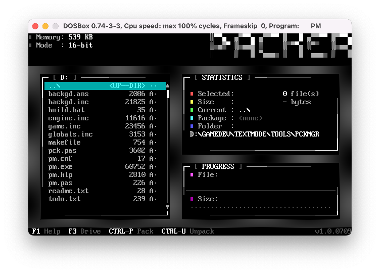

# TMGDL

Text mode game development library for Borland/TMT Pascal. MS-DOS protected-mode binaries are included in each game folder.
This is a work in progress.

## Games included:

- 2048 (updated version from https://github.com/dzutrinh/2048)
- Game of Life
- Tic-Tac-Toe (Player vs Player or Player vs AI)
- Tetris

## Screenshots 

### 2048

### Game of Life

### Tic-Tac-Toe

### Tetris

## Work in progress

### Package Manager

### Installer

